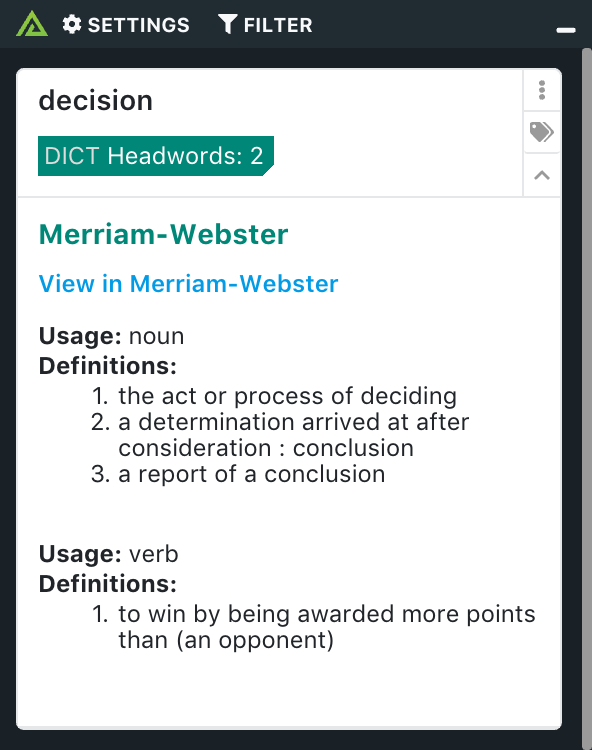

# Polarity Merriam-Webster Integration

The Polarity Merriam-Webster integration is an on-demand integration which searches for individual words in the Merriam-Webster collegiate dictionary. This gives you access to definitions for any word right at your fingertips as you work.

> This integration should only be run on in on-demand mode since recognition will cause it to search for every word on screen.

## Merriam-Webster Integration Options

### API Key

The Merriam-Webster dictionary API key used to access the API.

## Installation Instructions

Installation instructions for integrations are provided on the [PolarityIO GitHub Page](https://polarityio.github.io/).

## Polarity

Polarity is a memory-augmentation platform that improves and accelerates analyst decision making.  For more information about the Polarity platform please see:

https://polarity.io/